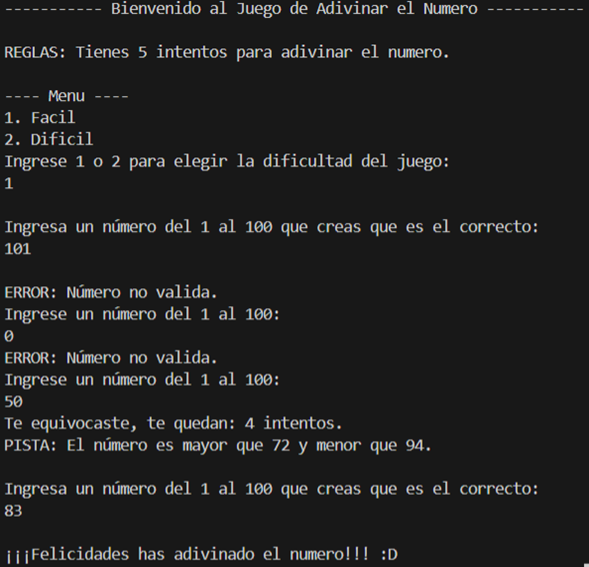
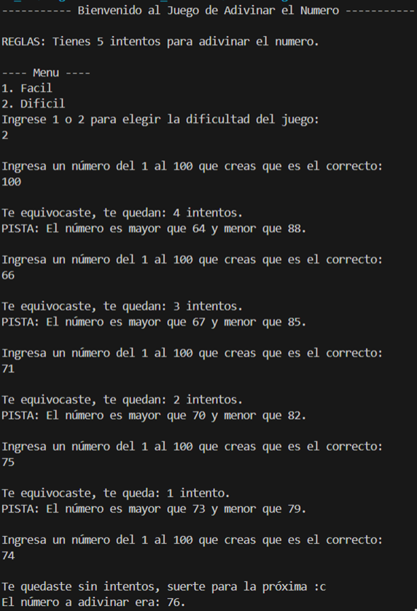

# JuegoAdivinanzaJava
### 

### Diferencias entre el Modo Fácil y el Modo Difícil

Rango de las Pistas:
- Modo Difícil: Las pistas proporcionan un rango amplio, lo que dificulta la adivinanza.
- Modo Fácil: Las pistas son más precisas y el rango de números es considerablemente menor, lo que facilita reducir las opciones.

Nivel de Precisión:
- Modo Difícil: Los rangos suelen abarcar varias decenas de números, aumentando el desafío.
- Modo Fácil: Los rangos se reducen drásticamente con cada pista.

Estrategia Recomendada:
- Modo Fácil: Se puede jugar con aproximaciones amplias al inicio e ir refinando las conjeturas.
- Modo Difícil: Es más efectivo utilizar un enfoque lógico desde el principio, aprovechando cada pista para descartar rápidamente opciones.

### Capturas de Pantalla

### Caso de Uso: Validación de Entrada y Éxito en la Adivinanza

Descripción: El jugador realiza intentos para adivinar el número, con validación de entradas y mensajes de error en caso de valores fuera del rango permitido.

Flujo Principal:
- El jugador es recibido con un mensaje de bienvenida y se le presentan las reglas del juego.
- El jugador elige la dificultad ingresando '1' para "Fácil" o '2' para "Difícil".
- El jugador intenta adivinar el número ingresando un valor dentro del rango permitido (1 al 100).
-   Si el número es incorrecto, se muestra una pista indicando un nuevo rango de posibles respuestas y se informa la cantidad de intentos restantes.
-   Si el número es correcto, el sistema muestra un mensaje de felicitación y finaliza el juego.

Flujo Alternativo:
- Si el jugador ingresa un número fuera del rango permitido (menor que 1 o mayor que 100), el sistema muestra un mensaje de error indicando que el valor es inválido y solicita que ingrese un número válido. 
   
 
 
### Caso de Uso: Modo Difícil

Descripción: El jugador selecciona el modo "Difícil", en el que las pistas son más reducidas y requieren mayor precisión en la adivinanza.

Flujo Principal:
- El jugador es recibido con un mensaje de bienvenida y se le presentan las reglas del juego.
- El jugador elige la dificultad ingresando '2' para "Difícil".
 -El jugador intenta adivinar el número ingresando un valor dentro del rango permitido (1 al 100).
-   Si el número es incorrecto, se muestra una pista más precisa (con un intervalo de números más estrecho que en el modo "Fácil") y se informa la cantidad de intentos restantes.
- El juego espera el siguiente intento hasta que el jugador acierte el número o se quede sin intentos.
-   Si el jugador se queda sin intentos, el sistema revela el número correcto.

Flujo Alternativo:
- Si el jugador ingresa un número fuera del rango permitido, el sistema muestra un mensaje de error indicando que el valor es inválido y solicita que ingrese un número válido.
- Si el jugador acierta el número antes de agotar sus intentos, el sistema muestra un mensaje de felicitación y finaliza el juego.

### Enlaces Relacionados
- Repositorio en GitHub
  [Github](https://github.com/Saranili-04/JuegoAdivinanzaJava)
- Tablero en Microsoft Planner
  [Gestor Plannner - Microsoft](https://planner.cloud.microsoft/webui/plan/0oHsPRvdO0ekiwhco9_jymQAC_Im/view/grid?tid=f94bf4d9-8097-4794-adf6-a5466ca28563)

